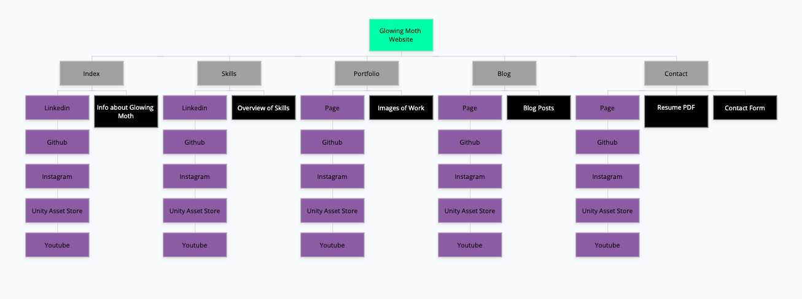

Link to Portfolio Website: http://glowingmoth.com 
Link to Github Repository: https://github.com/glowingmoth/PortfolioWebsite

## Description of Portfolio Website
**Purpose** 
The purpose of this website is to give people a way to find out more about myself and glowing moth as an independent game developer. To showcase my skill as 3d artist and coder/web developer.
 

**Functionality / Features** 
The website has a basic structure and layout where the user can simple choose from the navbar in the header or the navbar in the footer. The header will navigate to different pages, whilst the footer will open new page tabs to external social media sites where more info can be found on glowing moth and myself. 

**Sitemap**

 

**Screenshots**

 

**Target Audience**
 
The audience the website is intended for is any age, as there is nothing mature or un-ethical in nature. I do however expect the ages between 15-50. Where the younger age group would be coming more from a game development/gaming background, and the older age group from business related and web development backgrounds.
 

**Tech Stack** 
To create this website I used a combination of the following technologies: 
Vs Code - To work on all items within the project. 
HTML5 - For the structure of the website. 
CSS3 - For styling most of the website content. 
Font Awesome - Used for icons. 
Animate.css - Simple way to animate. 
Git - Version control system. 
Github - Online version control using git. 
